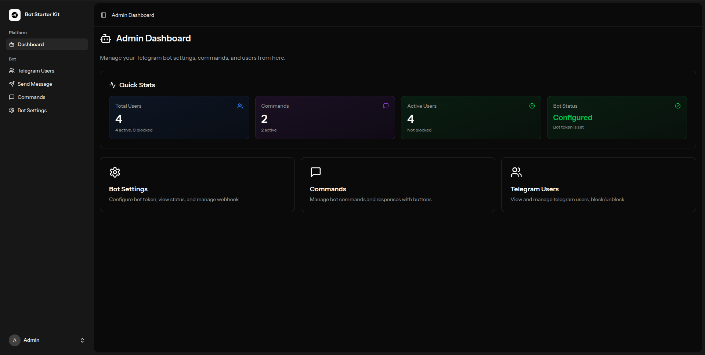
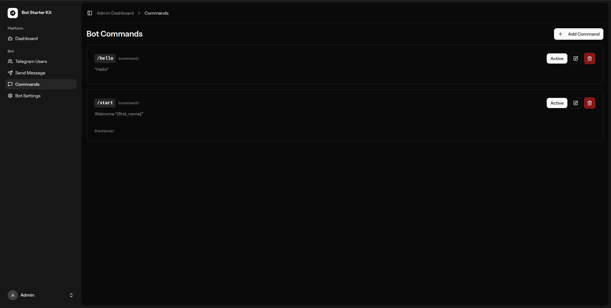
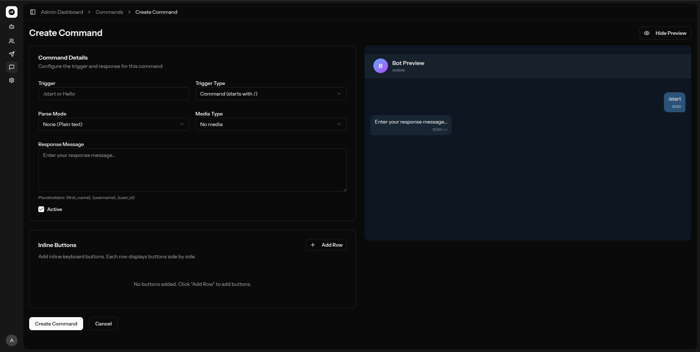
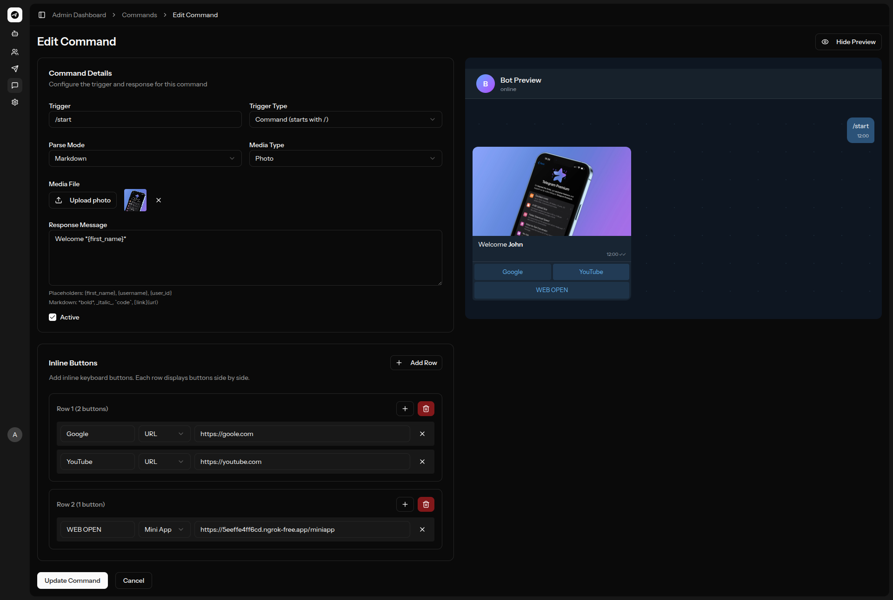
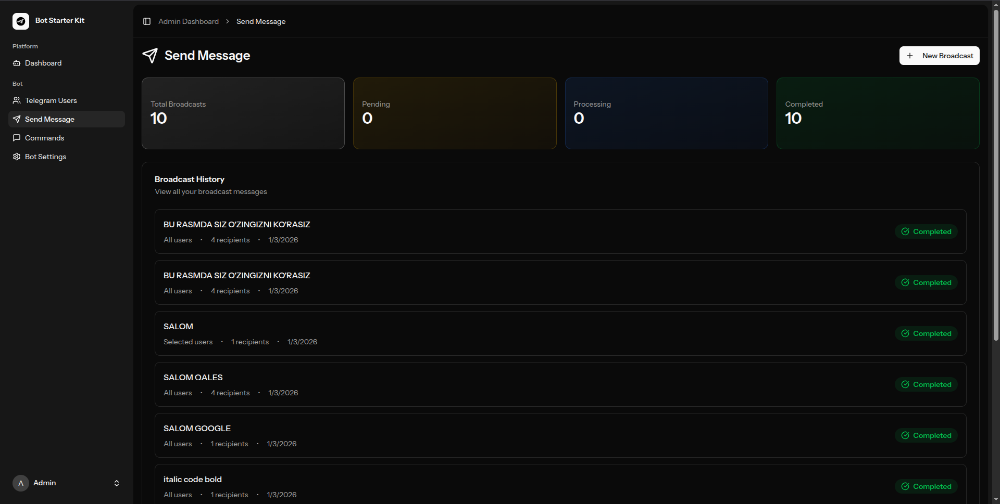
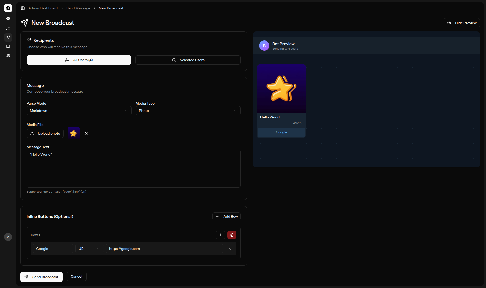
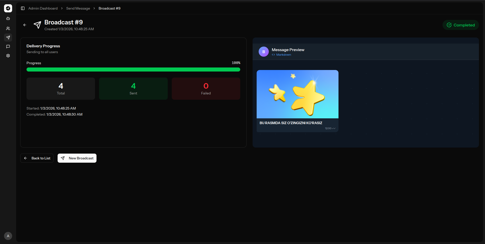
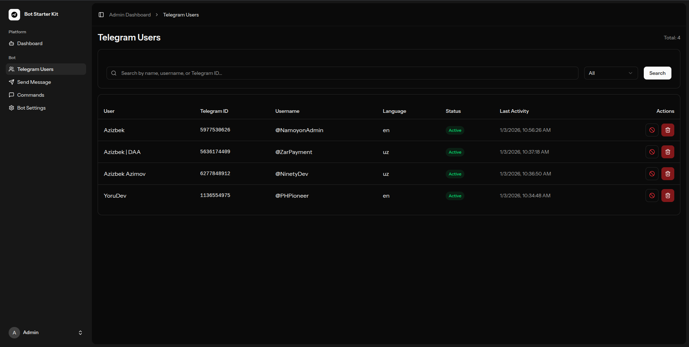
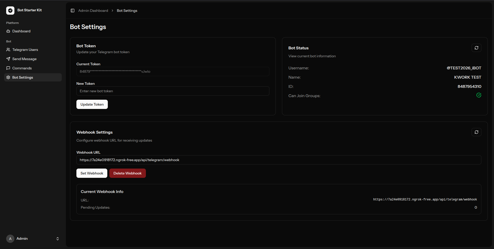

<p align="center">
  
</p>

<h1 align="center">🤖 Laravel Telegram Bot Starter Kit</h1>

<p align="center">
  <strong>Laravel bilan Telegram botlar yaratish uchun zamonaviy, ishlab chiqarishga tayyor starter kit</strong>
</p>

<p align="center">
  <a href="#xususiyatlar">Xususiyatlar</a> •
  <a href="#skrinshotlar">Skrinshotlar</a> •
  <a href="#ornatish">O'rnatish</a> •
  <a href="#foydalanish">Foydalanish</a> •
  <a href="#sozlamalar">Sozlamalar</a> •
  <a href="#litsenziya">Litsenziya</a>
</p>

<p align="center">
  <a href="README.md">🇬🇧 English</a> •
  <a href="README-RU.md">🇷🇺 Русский</a>
</p>

---

## ✨ Xususiyatlar

### 🎛️ Admin Panel

- **Chiroyli UI** — React 19 va Tailwind CSS 4 bilan qurilgan zamonaviy, responsive admin panel
- **Real-time Statistika** — Foydalanuvchilar, buyruqlar va bot holatini bir qarashda kuzating
- **Qorong'i/Yorug' rejim** — Tizim sozlamalariga moslashuvchi to'liq mavzu qo'llab-quvvatlashi

### 👥 Foydalanuvchilar Boshqaruvi

- **Telegram Foydalanuvchilari** — Barcha bot foydalanuvchilarini ko'rish, qidirish va boshqarish
- **Bloklash/Blokdan chiqarish** — Foydalanuvchi botga kirishini nazorat qilish
- **Faollik Kuzatuvi** — Foydalanuvchi faolligini va oxirgi harakatini kuzatish

### 💬 Dinamik Buyruqlar

- **Vizual Buyruq Yaratuvchi** — Kod yozmasdan buyruqlar yarating
- **Ko'p turdagi triggerlar** — `/buyruq` va matn triggerlari qo'llab-quvvatlash
- **Boy Javoblar** — HTML, Markdown va MarkdownV2 formatlash
- **Media Qo'llab-quvvatlash** — Rasm, video, audio, ovozli xabar va hujjatlar biriktiring
- **Inline Tugmalar** — URL, Mini App va callback tugmalari bilan interaktiv klaviaturalar yarating
- **Jonli Ko'rib chiqish** — Tahrirlash vaqtida Telegram uslubidagi oldindan ko'rish

### 📢 Broadcast Xabarlar

- **Ommaviy Xabar** — Barcha foydalanuvchilarga yoki tanlangan qabul qiluvchilarga xabar yuborish
- **Foydalanuvchi Qidirish** — AJAX qidiruv bilan maxsus foydalanuvchilarni toping va tanlang
- **Media Biriktirmalar** — Rasm, video, audio va hujjatlarni qo'shing
- **Inline Klaviaturalar** — Broadcastlarga interaktiv tugmalar qo'shing
- **Progress Kuzatuv** — Yuborilgan/muvaffaqiyatsiz hisoblagichlar bilan real-time progress
- **Queue-asosli** — Telegram API limitlarini hurmat qilgan rate-limited yetkazish

### ⚙️ Bot Sozlamalari

- **Oson Konfiguratsiya** — Admin paneldan to'g'ridan-to'g'ri bot tokenini o'rnating
- **Webhook Boshqaruvi** — Bir marta bosish bilan webhooklarni o'rnating, yangilang yoki o'chiring
- **Holat Monitoring** — Bot ma'lumotlari va webhook holatini real-time ko'ring

---

## 📸 Skrinshotlar

### 📊 Dashboard


### 💬 Buyruqlar Boshqaruvi





### 📢 Broadcast Xabarlar





### 👥 Telegram Foydalanuvchilari



### ⚙️ Bot Sozlamalari



---

## 🛠️ Texnologiyalar

| Kategoriya | Texnologiyalar |
|------------|----------------|
| **Backend** | Laravel 12, PHP 8.2+ |
| **Frontend** | React 19, TypeScript, Inertia.js |
| **Stillar** | Tailwind CSS 4, shadcn/ui |
| **Ma'lumotlar bazasi** | MySQL / PostgreSQL / SQLite |
| **Queue** | Laravel Queue (Redis/Database) |
| **Autentifikatsiya** | Laravel Fortify |

---

## 📦 O'rnatish

### Talablar

- PHP 8.2 yoki yuqori
- Composer
- Node.js 18+ & pnpm/npm
- MySQL, PostgreSQL yoki SQLite

### Tez Boshlash

```bash
# Repositoriyani klonlash
git clone https://github.com/your-username/laravel-bot-starter-kit.git
cd laravel-bot-starter-kit

# PHP bog'liqliklarini o'rnatish
composer install

# Node.js bog'liqliklarini o'rnatish
pnpm install

# Environment faylini nusxalash
cp .env.example .env

# Ilova kalitini yaratish
php artisan key:generate

# Ma'lumotlar bazasi migratsiyalarini ishga tushirish
php artisan migrate

# Frontend aktivlarini yaratish
pnpm run build

# Storage havolasini yaratish
php artisan storage:link

# Development serverini ishga tushirish
php artisan serve
```

### Queue Worker (Broadcast uchun zarur)

```bash
php artisan queue:work --queue=broadcasts
```

---

## ⚙️ Sozlamalar

### Telegram Bot Token

1. [@BotFather](https://t.me/BotFather) bilan bot yarating
2. Admin → Bot Sozlamalari ga o'ting
3. Bot tokeningizni kiriting va saqlang
4. Webhook URL ni sozlang

### Environment O'zgaruvchilari

```env
# Ilova
APP_URL=https://sizning-domeningiz.com

# Telegram (ixtiyoriy - admin paneldan sozlash mumkin)
TELEGRAM_BOT_TOKEN=sizning-bot-tokeningiz
TELEGRAM_WEBHOOK_URL=https://sizning-domeningiz.com/api/telegram/webhook

# Queue (broadcastlar uchun)
QUEUE_CONNECTION=database
```

---

## 🚀 Foydalanish

### Buyruqlar Yaratish

1. **Admin → Buyruqlar** ga o'ting
2. **Buyruq Yaratish** tugmasini bosing
3. Trigger o'rnating (masalan, `/start`, `/help`)
4. Formatlash bilan javob qo'shing
5. Ixtiyoriy ravishda media va inline tugmalar qo'shing
6. Ko'rib chiqing va saqlang

### Xabar Yuborish (Broadcast)

1. **Admin → Xabar Yuborish** ga o'ting
2. **Yangi Broadcast** tugmasini bosing
3. Qabul qiluvchilarni tanlang (barcha foydalanuvchilar yoki maxsus qidirish)
4. Formatlash bilan xabar yozing
5. Media va tugmalar qo'shing (ixtiyoriy)
6. Ko'rib chiqing va yuboring

### Maxsus Mantiq Qo'shish

Buyruqlarni maxsus ishlov berish uchun webhook controllerni kengaytiring:

```php
// app/Http/Controllers/TelegramWebhookController.php

protected function handleCommand(string $command, array $update): void
{
    match ($command) {
        '/maxsus' => $this->handleMaxsusCommand($update),
        default => $this->handleDynamicCommand($command, $update),
    };
}
```

---

## 📁 Loyiha Tuzilishi

```
├── app/
│   ├── Http/Controllers/
│   │   ├── Admin/           # Admin panel controllerlar
│   │   └── TelegramWebhookController.php
│   ├── Jobs/
│   │   └── SendBroadcastMessageJob.php
│   ├── Models/
│   │   ├── BotCommand.php
│   │   ├── BroadcastMessage.php
│   │   └── TelegramUser.php
│   └── Services/
│       └── TelegramBotService.php
├── resources/js/
│   ├── components/          # UI komponentlar
│   ├── layouts/             # Ilova layoutlari
│   └── pages/admin/         # Admin sahifalari
└── routes/
    ├── admin.php            # Admin routelar
    └── api.php              # Webhook routelar
```

---

## 🤝 Hissa Qo'shish

Hissa qo'shishingiz kutiladi! Pull Request yuborishdan tortinmang.

1. Repositoriyani fork qiling
2. Feature branch yarating (`git checkout -b feature/ajoyib-xususiyat`)
3. O'zgarishlaringizni commit qiling (`git commit -m 'Ajoyib xususiyat qo'shildi'`)
4. Branchni push qiling (`git push origin feature/ajoyib-xususiyat`)
5. Pull Request oching

---

## 📄 Litsenziya

Bu loyiha [MIT litsenziyasi](LICENSE) ostida ochiq manbali dasturiy ta'minot sifatida litsenziyalangan.

---

<p align="center">
  Telegram Bot hamjamiyati uchun ❤️ bilan yaratildi
</p>
